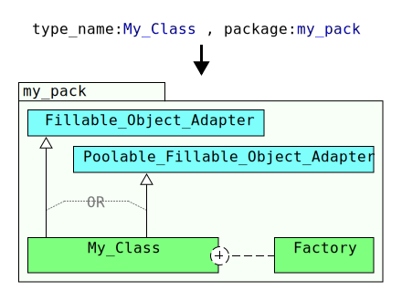

# WAsys_pojo_http_data_entity_tool
Simple tool for making skeleton of `Fillable_Object` [WAsys_simple_generic_object_pool](https://github.com/911992/WAsys_simple_generic_object_pool) (also as `Poolable_Object`([WAsys_simple_generic_object_pool](https://github.com/911992/WAsys_simple_generic_object_pool))) entities.

**WAsys `Fillable_Object` Skeleton Generator Tool** is a very simple `GUI/CLI` tool that generates a `Fillable_Objects` based on user's input.  

  
*diagram 0: social media vector*

## Revision History
Latest: v0.2.7 (Aug 29, 2020)  
Please refer to [release_note.md](./release_note.md) file  

## Requirments
0. Java 1.8  
1. A desktop shell (if graphical interface is desired)

## How To Build
You could build the project using either Maven or Ant, or simply using the latest release from the repository.  

### Using Ant
0. Clone the repository  using `git -clone https://github.com/911992/WAsys_pojo_http_data_entity_tool.git`
1. Build the project using ant as `ant -v clean jar`
2. Artifact under `dist` folder

### Using Maven
0. Clone the repository  using `git -clone https://github.com/911992/WAsys_pojo_http_data_entity_tool.git`
1. Build the project using maven as `mvn clean package`
2. Artifact under `target` folder

## Usage 
Project has two `main` classes as `Main_GUI`, and `Main_CLI`. Once project is built, simply run the jar file as `java -jar <<artifact_name>>`.  
By default it shows the help(`-h`) command, something like following.
```
$ java -jar ./dist/WAsys_pojo_http_data_entity_tool.jar
Error! zero-length input argument is not expected!
WAsys Fillable_Object Skeleton Generator v0.2.7(20200829)
https://github.com/911992/WAsys_pojo_http_data_entity_tool
-----------
Command Lines:
-h                                  :Shows this help(ignore other cmds)
-fancy                              :Runs the tool in GUI mode
-class <<entity_type_name>>         :Tells the type's name(could be skipped)
-package <<entity_package_name>>    :Tells the type's package name(could be skipped)
-poolable                           :Tells to make the object as a Poolable_Object too
-pol <<pool_policy_stmt>>           :Tells the statement/syntax for setting the pool policy variable(could be skipped, will be skipped if -poolable is absent)
-save                               :Saves the output to a .java file to current path(required -class, ignores -fout)
-fout <<file_out>>                  :Specifies the file as output(if absent, STDOUT will be used)
```

### Sample Usage
Considering following scenarios, for generating `Fillable_Object` entities.  

#### Scenario 0
Class name: `My_Class`  
Package : none  
As `Poolable_Object`: no  
Pool Policy Statement: n/a  
Output: `STDOUT` (default)  
**Command:** `java -jar <<artifact_name>> -class My_Class`


#### Scenario 1
Class name: `Good_Type`  
Package : `com.github.911992`  
As `Poolable_Object`: no  
Pool Policy Statement: n/a  
Output: File, as `sample_output.txt`  
**Command:** `java -jar <<artifact_name>> -class Good_Type -package com.github.911992 -fout Good_Type.txt`

#### Scenario 2
Class name: `Guru_Entity`  
Package : `com.github.911992`  
As `Poolable_Object`: yes  
Pool Policy Statement: `Meta_Class.get_default_pool_policy()`  
Output: to related `.java` class  
**Command:** `java -jar <<artifact_name>> -class Guru_Entity -package com.github.911992 -poolable -pol Meta_Class.get_default_pool_policy() -save`  
*Result will be saved to `Guru_Entity.java` file*

### Graphical Interface
For running the graphical interface, run the artifact using `-fancy` command. It looks something liek following.

  
*Figure 0: graphical interface*

## Generated Entity
Tool could produce only `Fillable_Object`, or `Fillable_Object` + `Poolable_Object` where being pooled is considered also.

### `Fillable_Object` Only Entity
`Fillable_Object`-*only* entities are extended `Fillable_Object_Adapter`, and implemented `Fillable_Object_Parse_Cache_Accelerator` (for fast cache access).

Type will have a default public constructor(unlike the pooled mode). Since update `0.2.7`, generated class will have a static inner `Factory` class that works as factory for teh type.

`Factory` class could be accessible by `get_obj_factory(void):Object_Factory` `static` method.

Considering the class diagram of generated type for `Fillable_Object` **only** artifact.

  
*diagram 1: [`Filalble_Object` **only** generated class/artifact class diagram](./_docs/_diagrams/filalble_gen_artifact_class_diagram.svg)*

### `Fillable_Object` And `Poolable_Object` Entity
`Fillable_Object` and `Poolable_Object` artifacts are extended from `Poolable_Fillable_Object_Adapter` which is a adapter implements both `Fillable_Object`, and `Poolable_Object` interfaces.

Like non-poolable entity mode, a `Fillable_Object` and `Poolable_Object` generated type also implements `Fillable_Object_Parse_Cache_Accelerator`.

Type will have a dedicated instansion mechanism(like [`WAsys_poolable_entity_tool`](https://github.com/911992/WAsys_Poolable_Object_generator_tool)) by marking the default constructor `private`, and a embdedded(inline) `Object_Factory` class. It follows the rest generation policy of `Fillable_Object` *Only* mode.

Considering the class diagram of generated type for `Fillable_Object` and `Poolable_Object`

Since version `0.2.7`, the underlying `__factory__:Object_Factory` instance could be accessed using `get_standalone_obj_factory():Object_Factory` method, that would instance of the entity *out of* pool context.

Same the `get_pool():Object_Pool` returns the underlying `__pool__:Object_Pool` instance.

  
*diagram 2: [`Filalble_Object` and `Poolable_Object` generated class/artifact class diagram](./_docs/_diagrams/filalble_poolable_gen_artifact_class_diagram.svg)*

### Notes
**Note:** To avoid abusing/confusion of generated type becasue of implemented `Fillable_Object_Parse_Cache_Accelerator`, the generated type is marked as `final`.

**Note:** If you wish to inherit another type from the generated type, make sure to implement the `Fillable_Object_Parse_Cache_Accelerator` on inherited type, or remove it from the generated type completely.

## Using A Generated Entity
`Fillalbe_Object` **only** entities come without any specific instansation process(like factory, builder...) by default, so using `new` keyword and default `public` constructor would does the job.

Considering
```java
User_Credential _uc = new User_Credential();
//...filling the _us using a Request_Data_Handler, like Servlet_Request_Data_Handler 
//...
//in order to reuse the entity, reset the state first by callid reset_fill_state
_uc.reset_fill_state();
//performing anotehr fill, and so on...
```
*code snippet 0: using a generated `Fillable_Object` **Only** generated entity*

### `Fillalbe_Object` And `Poolable_Object` Entity
This is highly recommended to use a `try-with-resources` block working with `Fillalbe_Object` and `Poolable_Object` generated entity. As the target entity is also as `AutoClosable`, and would return the entity to the related ppol when no more is needed.

Considering
```java
try(Message_Form_Entity _ins = Message_Form_Entity.get_an_instance();){
    //...filling the _us using a Request_Data_Handler, like Servlet_Request_Data_Handler 
    //...
    //in order to reuse the entity, reset the state first by callid reset_fill_state
    _uc.reset_fill_state();
    //performing anotehr fill, and so on... 
}//automatically releasing and restarting the instance
```
*code snippet 1: using a `Fillable_Object` and `Poolable_Object` generated entity in `try-with-resources` block*

But for situation where using a `try-with_resources` is not applicable. Considering
```java
Post_Form_Entity _ins = Post_Form_Entity.get_an_instance();
//...filling the _us using a Request_Data_Handler, like Servlet_Request_Data_Handler 
//...using the _ins once or several times... (make sure to call reset_fill_state() between each use)
//...
_ins.back_to_pool();//IMPORTANT, releasing the _ins into its pool
```
*code snippet 2: using a `Fillable_Object` and `Poolable_Object` generated entity, manually releasing*

Please mind to **not forget** to **release** the instance once it's no more needed, otherwise inconsistency and/or UB may happen.

## Meta
Generated types are dependent on following libs/repos

0. [WAsys_pojo_http_data](https://github.com/911992/WAsys_pojo_http_data) ([WAsys_pojo_http_data_servlet3_wrapper](https://github.com/911992/WAsys_pojo_http_data_servlet3_wrapper)) repo/lib that this tool is supposed to be a helper for
1. [WAsys_simple_generic_object_pool](https://github.com/911992/WAsys_simple_generic_object_pool) `Fillable_Object` and `Poolalbe_Object` generated entries are dependent to this repo too
2. `Poolable_Object` entity tool [WAsys_Poolable_Object_generator_tool](https://github.com/911992/WAsys_Poolable_Object_generator_tool)

### Icon Of Graphical Interface
Icon image of grphical interface is a windows 9x icon known as `app-wizard-file`(or something like that).  
  
*Figure 1: graphical interface icon*
